```{r setup, include=FALSE}
knitr::opts_chunk$set(echo = FALSE)
knitr::opts_chunk$set(message = FALSE)
library(knitr)
library(ggplot2)
library(dplyr)
library(mnormt)
library(circular)
```


## Overview:

> 1. Shiny App for Pooled Sampling

```{r, out.width = "2000px"}
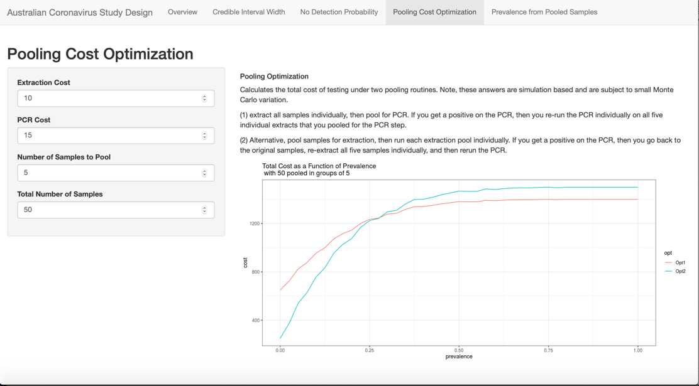
```


## Overview:


> 2. Two-Phased Pooled Sampling for CoV Prevalence

```{r, out.width = "500px"}
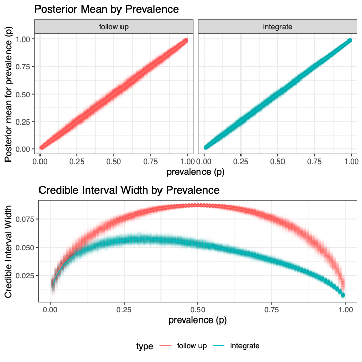
```


## Overview:


> 3. Data integration for pooled sampling and estimation of CoV prevalence

```{r, out.width = "2000px"}
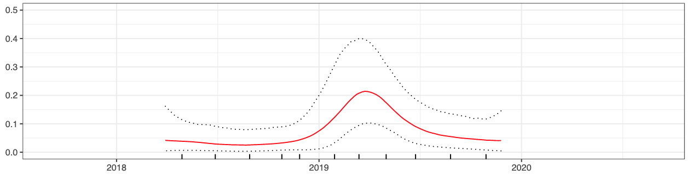
```

# Part 1: Shiny App for Pooled Sampling

## Shiny App Overview

```{r, out.width = "2000px"}

```

[https://andrewhoegh.shinyapps.io/Australian_Samples](https://andrewhoegh.shinyapps.io/Australian_Samples)

# Part 2: Two-Phased Pooled Sampling for CoV Prevalence

## Research Questions

- DARPA-funded study with intent to establish a baseline understanding of spatiotemporal dynamics of CoV shedding in bats

- Optimal use of collection of pre-existing specimens (note: implications could be different if the most expensive part of the process is obtaining samples)

- Can we use pooled testing, without follow up, be used to obtain more precise prevalence estimates?

- Can an adaptive pooling approach result in efficient pool size?

## Pooled Testing

```{r, out.width = "800px"}
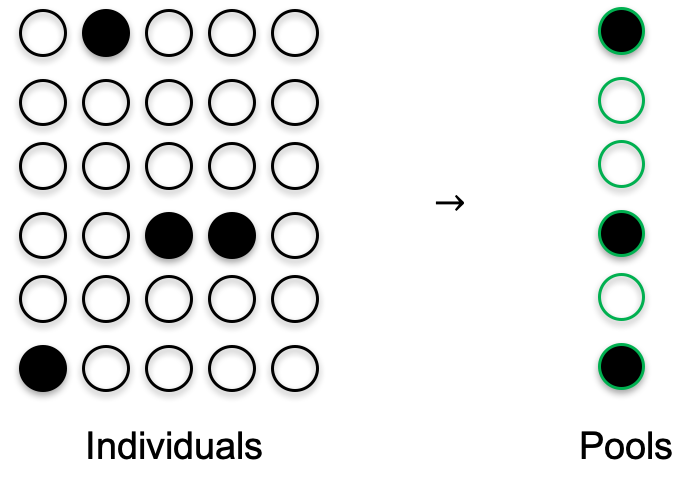
```

## Pool Structure 

```{r, out.width = "800px"}
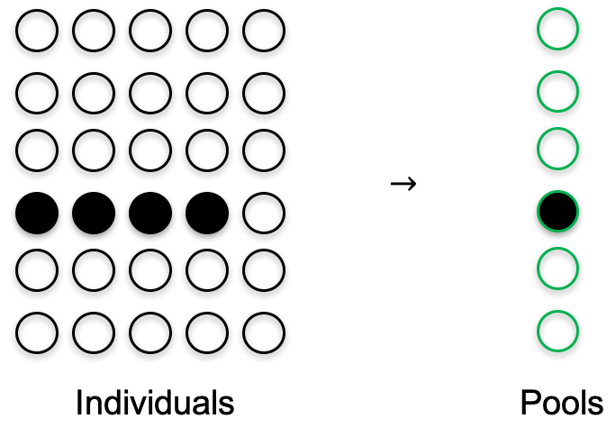
```

## Optimal Pooling

$\pi = 1 - (1-p)^k$

- where $\pi$ is the probability of a pool of size k testing positive

- $p$ is the prevalence in the population

- optimal pool size depends on unknown $p$

## Benefits of Pooled Sampling

- When prevalence is _low_ pooled sampling can result in more efficient estimates of overall prevalence for the same sampling cost/effort 

- __or__ for less sampling cost prevalence estimates can acheive the same precision.

- "If the goal is to estimate population prevalence, rather than identify individuals that are positive, testing new individuals ... is a more efficient procedure than retesting individuals in the original pool.


## Pooled Prevance 

```{r, out.width = "600px"}
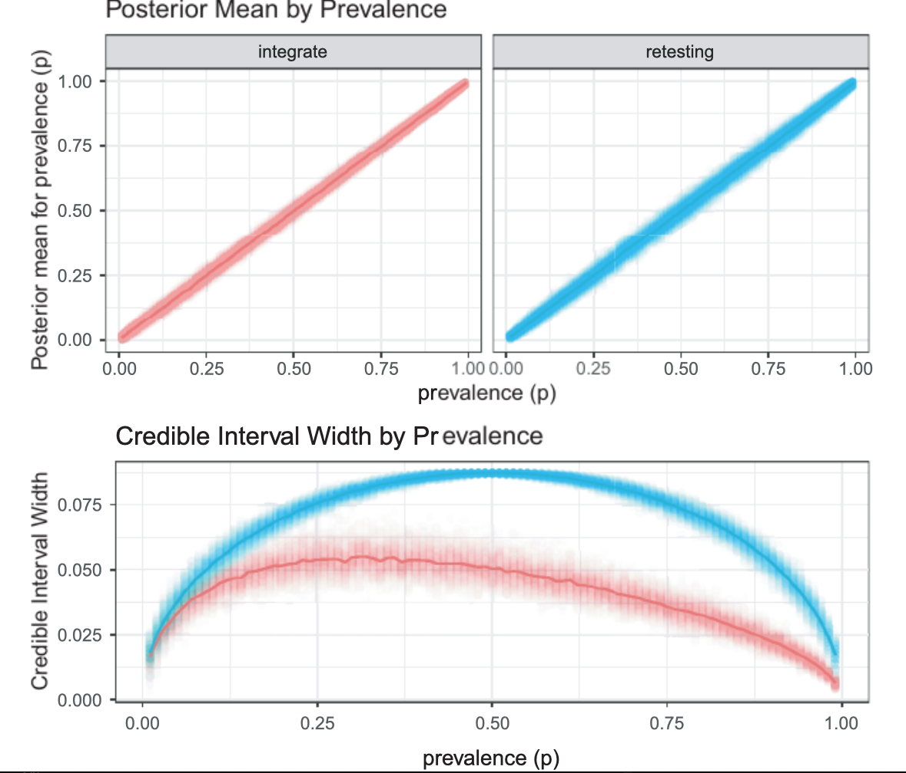
```

## Adaptive Pooling

- Using a pooled sampling framework we can estimate population prevalence (with uncertainty) 

- That prevalence can be used to update pool size^ and re-estimate prevalence...

- ^ adaptive updates of pools size may not be practical


# Part 3: Data integration for pooled sampling and estimation of CoV prevalence


## Gaussian Process

<div style="float: left; width: 60%;">

```{r, out.width = "750px"}
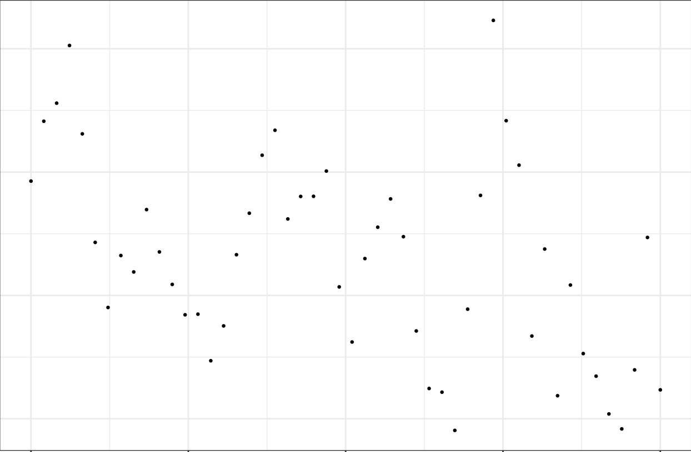
```

 
</div>
<div style="float: left; width: 10%;">
</div>
<div style="float: right; width: 30%;">

Prevalence changes over time

- A Gaussian process can "connect the dots"

</div>

## Burleigh Prevalence

```{r, out.width = "2500px"}
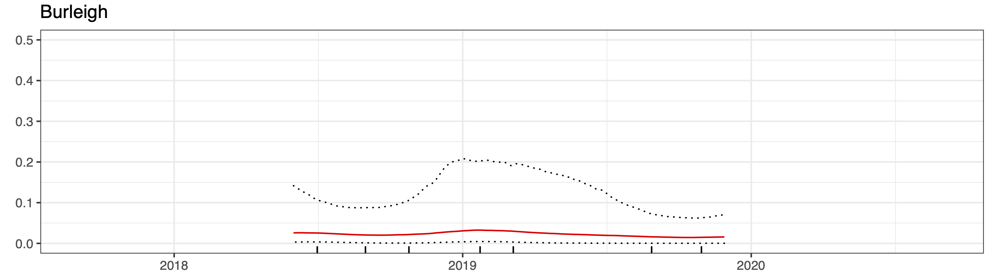
```

## Clunes Prevalence

```{r, out.width = "2500px"}
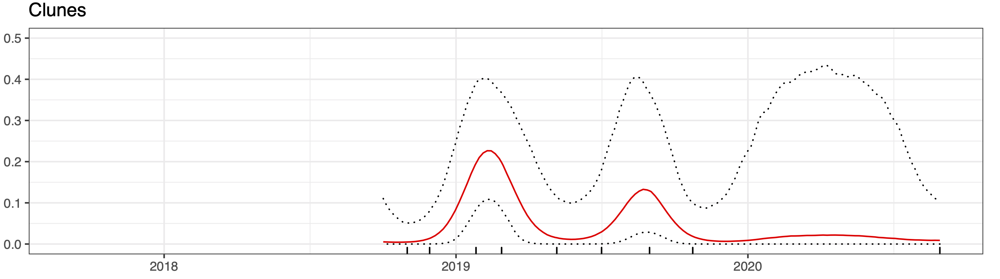
```

## Redcliffe Prevalence

```{r, out.width = "2500px"}
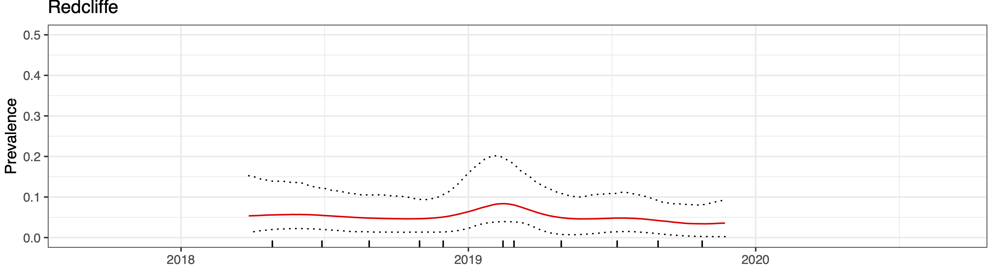
```

## Sunnybank Prevalence

```{r, out.width = "2500px"}
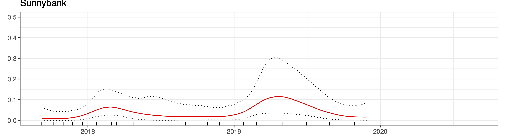
```

## Toowoomba Prevalence

```{r, out.width = "2500px"}
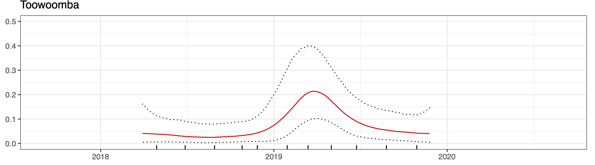
```

## Concluding Thoughts 

1. With lower prevalence, pooling (without retesting) can give more precise estimates

2. Optimal pooling depends on prevalence, but pilot or multiphase studies can inform pooling size

3. Prevalence does have temporal __and__ spatial variability

4. Serology studies or  approaches that move beyond a snapshot of active shedding would be helpful

5. Without a substantial number of samples at a site, uncertainty will tend to be large. Modeling approaches may be able smooth estimates and combine inferences across sites to obtain more precise estimates.
